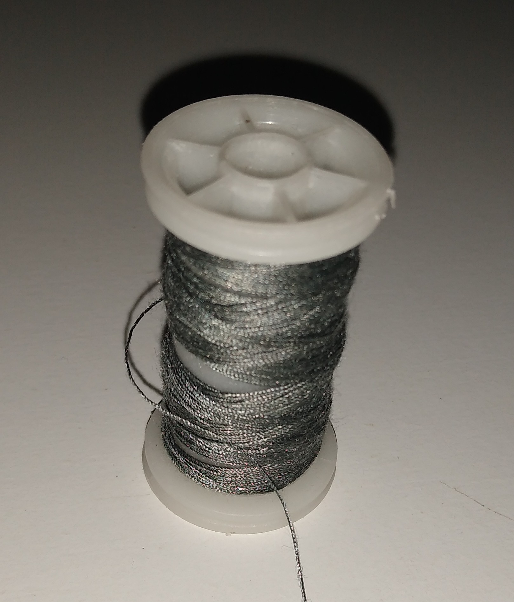

# Proyecto-I-Mecatrónica

## Prototipo Realizado

Se realizó un prototipo de mano mecatrónica controlada mediante un pulsador que acciona un servomotor:

<div>
<p style = 'text-align:center;'>

</p>
<div>

## Inspiración:

El prototipo de mano mecatrónica está basado en el diseño del objeto "The Gunslinger" del videojuego Team Fortress 2:

[](https://www.youtube.com/watch?v=my6TfPgCKaU)

## Fabricación: 

### Materiales:

Para la fabricación de las articulaciones de los dedos, se utilizó una cadena genérica de bicicleta:

<div>
<p style = 'text-align:center;'>

</p>
</div>

Como base para la muñeca de la mano, se utilizó un resorte de tracción lineal (Zugfedern), con largo 17 cm, diámetro interno 1.6 cm y diámetro externo 2 cm:

<div>
<p style = 'text-align:center;'>

</p>
</div>

Como base de los demas componentes se utilizo cartón compacto gris:

<div>
<p style = 'text-align:center;'>

</p>
</div>


Para articular los dedos, se utilizan tuercas y tornillos:

<div>
<p style = 'text-align:center;'>

</p>
</div>

Se utilizó hilo para unir los dedos al servomotor:

<div>
<p style = 'text-align:center;'>

</p>
</div>

Se utilizan gomas elásticas para movilizar los dedos a una posición inicial:

<div>
<p style = 'text-align:center;'>

</p>
</div>

Para la union de componentes, se utilizó principalmente cinta aislante eléctrica:
<div>
<p style = 'text-align:center;'>

</p>
</div>

### Componentes electrónicos:

Como placa de desarrollo, se utilizó una placa Arduino UNO:

<div>
<p style = 'text-align:center;'>

</p>
</div>

Para el accionamiento de la mano, se utiliza un microservomotor MG90 de engranajes plásticos:

<div>
<p style = 'text-align:center;'>

</p>
</div>

Para accionar el servomotor, se utiliza un pulsador se tamaño pequeño:

<div>
<p style = 'text-align:center;'>

</p>
</div>

Para la alimentación eléctrica del Arduino UNO, se utilizan 6 pilas AA recargables NiMh 1.2V, montadas sobre un portapilas, entregando aproximadamente 7.8 V:

<div>
<p style = 'text-align:center;'>

</p>
</div>

Se utilizó una resistencia electrica de 1 kOhm:

<div>
<p style = 'text-align:center;'>

</p>
</div>

Se utilizó una mini protoboard de 170 pines:

<div>
<p style = 'text-align:center;'>

</p>
</div>

Para cableado que requiera soldadura, se utilizó cable de audio duplex calibre 12:

<div>
<p style = 'text-align:center;'>

</p>
</div>

Para cableados directos entre componentes y Arduino, se utilizaron cables Dupont:

<div>
<p style = 'text-align:center;'>

</p>
</div>

### Herramientas:

Para separar los eslabones de la cadena en medidas regulares para los dedos, se utilizó una herramienta corta cadenas:

<div>
<p style = 'text-align:center;'>

</p>
</div>

Para el pegado de los componentes, se utilizó silicona caliente suministrada mediante una pistola dispensadora de tamaño pequeño (potencia de 15 W).

<div>
<p style = 'text-align:center;'>

</p>
</div>

Se utilizó además un cautín de 25 W y su respectiva soldadura de estaño-plomo.

### Procedimiento:

Dividir la cadena en 5 partes de similar tamaño, en este caso, se hicieron con dedos cercanos a 16 cm. 

<div>
<p style = 'text-align:center;'>

</p>
<div>

Dado que todos los eslabones de la cadena son partes móviles, se hace necesario volver rígidos aquellos que no requieran moverse. Para ello, es posible fijar los eslabones inmóviles con algún material que los sostengan, utilizar pegamento para fijar los ejes, o siguiendo la metodología utilizada en este proyecto, convertir el eje de cada eslabón en un pasador fijo golpeando cada eje con un martillo hasta que llegue al tope el eslabón, realizando entonces ajuste mecánico impidiendo el movimiento. En la siguiente imagen se muestran los únicos ejes que no fueron endurecidos, a fin de que estos actuen como articulaciones de la mano:

<div>
<p style = 'text-align:center;'>

</p>
<div>

Se ensabambla la base de cartón rígido con el interior del resorte, adhiriendo los dedos al cartón con silicona caliente, tal como se muestra en la siguiente imagen:

<div>
<p style = 'text-align:center;'>

</p>
<div>

Para evitar desensambles entre los dedos y la base, se aseguran los dedos con cinta aislante: 
<div>
<p style = 'text-align:center;'>

</p>
<div>

Se utilizan gomas elásticas entre los eslabones de cadena a articular para permitir el regreso a su posición inicial. Estos van unidos a los tornillos encajados en los eslabones y fijados a través de tuercas:

<div>
<p style = 'text-align:center;'>

</p>
<div>

Las fijaciones entre tornillo, tuerca y goma elástica se realizaron de la siguiente forma:

<div>
<p style = 'text-align:center;'>

</p>
<div>
  
Se procede a unir los dedos al servomotor mediante hilos, utilizando un pequeño tubo de plastico a modo de guia adherido en la palma de la mano:
  
<div>
<p style = 'text-align:center;'>

</p>
<div>
  
El servomotor se fija a la base de cartón procurando mantener la tensión de los hilos, la que depende de la posición deseada para los dedos:
  
<div>
<p style = 'text-align:center;'>

</p>
<div>

Las conexiones del Arduino se realizan según el siguiente diagrama:
  
<div>
<p style = 'text-align:center;'>

</p>
<div>  

Las conexiones quedan entonces de la siguiente forma:  
  
<div>
<p style = 'text-align:center;'>

</p>
<div>

Se realiza una caja de cartón forrado que contenga tanto el Arduino como la protoboard en una posición fija:
  
<div>
<p style = 'text-align:center;'>

</p>
<div>
  
Se acopla el pulsador a la base del resorte, soldando los bornes al cable de audio:
  
<div>
<p style = 'text-align:center;'>

</p>
<div>

El otro extremo de los cables de audio van soldados a cables Dupont, los que se adhieren mediante cinta a lo largo del resorte:
  
<div>
<p style = 'text-align:center;'>

</p>
<div>

Se realiza con cartón forrado las paredes de un tronco de cono con diámetro superior 6 cm y diámetro inferior 12 cm, el cual fue pintado con pintura acrilíca de color rojo:
  
<div>
<p style = 'text-align:center;'>

</p>
<div>
  
Se une mediante cinta el tronco de cono a la base el resorte haciendo coincidir ambos ejes, quedando entonces el prototipo de la siguiente forma:
  
<div>
<p style = 'text-align:center;'>

</p>
<div>
 
  
## Programación en Arduino:

El codigo en C++ utilizado fue el siguiente:
  
```C++
#include <Servo.h>

// C++ code
//

Servo servomotor;  // Nombrar el servo

int pinServo = 9;     // Definir el pin de señal para el servo
int angulo=170;       // Definir un angulo inicial en el servo
int pinPulsador1 = 8; // Definir el pin de señal para el pulsador
int Pulsador1 = 0;    // Definir el estado inicial en el pulsador
  
void setup()
{
  pinMode(LED_BUILTIN, OUTPUT);
  servomotor.attach(pinServo);  // Definir el pin de donde el servo recibirá la señal
  pinMode(pinPulsador1,INPUT);  // Definir como entrada de señal el pin definido para el pulsador
  servomotor.write(angulo);     // Posicionar el servo en el ángulo inicial
}

void loop()
{
  Pulsador1 = digitalRead(pinPulsador1); // Leer el estado en el pulsador
  if(Pulsador1 == HIGH){                 // Si está sin pulsar:
    angulo=170;                          // Mantiene/vuelve al ángulo inicial
  }
  if(Pulsador1 == LOW){                  // Si está pulsado:
    angulo=10 ;                          // Se define un nuevo angulo deseado
  }
servomotor.write(angulo);                // Se posiciona el servo en el angulo definido
delay(25);                               // Se añade una pequeña latencia para evitar errores
}
```
  
## Vídeo demostración
 
Haciendo click en la siguiente imagen es posible ver una demostración en vídeo del prototipo:
 
[](https://youtube.com/shorts/yCg7WOOUdeg)

